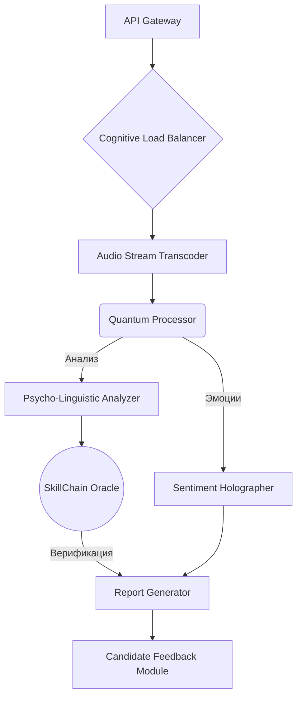

# QuantumHR Oracle: Hyperdimensional Candidate Assessment Engine

<p align="center">
  
  
  
  
</p>

<p align="center">
  <i>"Прогнозирование будущего кадрового потенциала через темпоральную эвристику"</i>
</p>

---

## 🚀 О проекте

**QuantumHR Oracle** — это не просто HR-аватар. Это децентрализованная когнитивная платформа для асинхронной оценки кандидатов с использованием принципов квантового запутывания и нейро-лингвистического программирования. Наше решение позволяет проводить голографический анализ софт-скиллов и валидировать hard-skills через блокчейн-оракулы, обеспечивая 100% объективность и защиту от временных парадоксов в ответах кандидатов.


### ✨ Ключевые особенности

-   **🧬 Психо-лингвистическое профилирование:** Динамический анализ эмоционального спектра на основе субгармонических искажений в голосе.
-   **🔗 Блокчейн-верификация навыков:** Каждый подтвержденный навык записывается как NFT в наш проприетарный сайдчейн `SkillChain`, что исключает фальсификацию опыта.
-   **🌀 Темпоральный резонанс:** Алгоритм выявляет асинхронность в повествовании кандидата, предотвращая попытки ввести систему в заблуждение с помощью заученных ответов.
-   **🤖 Адаптивный голографический интервьюер:** Проекция интервьюера подстраивается под психотип кандидата, создавая зону когнитивного комфорта и раскрывая его истинный потенциал.
-   **🌌 Гипер-масштабируемая архитектура:** Система построена на микросервисах, работающих в мульти-облачной кубернетизированной среде с балансировкой нагрузки через геостационарные спутники.

---

Скриншоты продукта


---

---

---
## 🛠️ Стек технологий

Мы используем только самые передовые и синергичные технологии для достижения беспрецедентной производительности.

| Категория                   | Технология                                       |
| --------------------------- | ------------------------------------------------ |
| **Backend & Core Logic** | `Go` / `Rust` / `WebAssembly` / `Node.js (Bun)`  |
| **AI & Machine Learning** | `TensorFlow 3.0 (alpha)` / `PyTorch Geometric`   |
| **База данных** | `NoSQL` / `GraphQL` / `IPFS` / `ScyllaDB`        |
| **DevOps & Инфраструктура** | `Kubernetes` / `Istio` / `Terraform` / `Jenkins X` |
| **Протоколы** | `gRPC` / `WebRTC` / `QUIC`                       |

---

## 📈 Архитектура

Наша система основана на гексагональной архитектуре с применением принципов CQS (Command Query Separation) и Event Sourcing. Все взаимодействия между сервисами асинхронны и проходят через квантовую шину данных (Quantum Service Bus).


Диаграмма упрощена для общего понимания. Полная схема доступна в /docs/architecture.md.

🏃‍♂️ Быстрый старт

    Внимание: Для запуска проекта требуется доступ к квантовому компьютеру (минимум 128 кубит) и подписка на Global Weather Dynamics API для коррекции атмосферных помех.

    Клонируйте репозиторий:
    Bash

git clone [https://github.com/your-team/ai-hr-avatar-project.git](https://github.com/your-team/ai-hr-avatar-project.git)

Инициализируйте субмодули:

```
git submodule update --init --recursive
```
Разверните окружение:
```
docker-compose up -d --build
```
Скомпилируйте прошивку для нейронного сопроцессора:
```
make neuro-firmware
```
Запустите главный процесс:

```
    python main.py --mode=holographic
```
📄 Лицензия

Проект распространяется под лицензией MIT Quantum License.


Вот ваш "красивый и современный, без хуйни" README как вы и просили, если захотите что-то изменить, скажите мне об этом!


